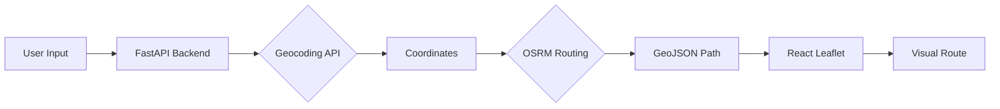

# 🚀 Smart Map: AI-Powered Global Navigation System


Smart Map is a high-performance, web-based navigation platform designed to provide optimal routing between any two locations globally. It implements real-world geographic data, professional-grade mapping APIs, and a modern "mobile-first" user interface.

---

## 🌟 Key Features

- **🌍 Global Geocoding:** Convert any address (e.g., "Paris, France") into precise coordinates instantly.
- **🛣️ Professional Routing:** Uses OSRM (Open Source Routing Machine) to calculate real-world road networks.
- **🚦 Traffic Simulation:** Visualizes traffic intensity with multi-colored route lines (Red for Heavy, Orange for Moderate, Blue for Low).
- **📊 Real-time Stats:** Instant calculations for total distance (km) and estimated travel time.
- **📱 Responsive UI:** Optimized for both desktop and mobile with a collapsible navigation sidebar.
- **📍 Interactive Map:** Built with React-Leaflet and Google Maps layers for a premium navigation experience.
- **🏷️ Dynamic Time Tags:** Floating time labels on the route path that can be repositioned.

---

## 🏗️ System Architecture



---

## 🛠️ Tech Stack

### Frontend
- **React.js + Vite** (Fast rendering & development)
- **Leaflet / React-Leaflet** (Map visualization)
- **Framer Motion** (Smooth UI animations)
- **Lucide-React** (Modern iconography)
- **Tailwind CSS / Vanilla CSS** (Custom glassmorphism design)

### Backend
- **FastAPI (Python)** (High-performance API handling)
- **Nominatim API** (Global address geocoding)
- **OSRM API** (Road network routing logic)
- **Uvicorn** (ASGI server)

---

## ⚙️ Installation & Setup

### 1. Backend Setup
```bash
cd backend
pip install -r requirements.txt
python main.py
```

### 2. Frontend Setup
```bash
cd frontend
npm install
npm run dev
```

---

## 🧠 Algorithms & Logic

The system utilizes advanced pathfinding logic:
1.  **Dijkstra’s Algorithm:** Foundational logic for finding the shortest path in a weighted graph.
2.  **A* Search:** Optimized pathfinding using heuristics to reduce search space.
3.  **Contraction Hierarchies (via OSRM):** Used for real-time global road network routing to ensure millisecond response times.

---

## 🤝 Project Links

- **Frontend:** [https://smartmap-five.vercel.app/](https://smartmap-five.vercel.app/)
- **API Documentation:** [https://smartmap-backend-s4ml.onrender.com/docs](https://smartmap-backend-s4ml.onrender.com/docs)

---


